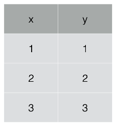
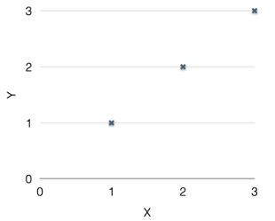
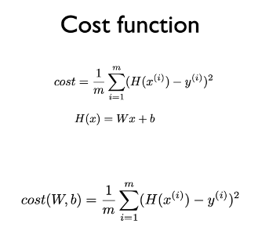
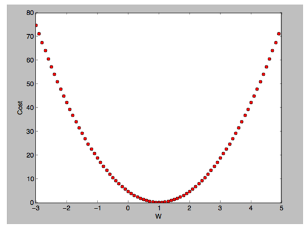

#### ML 1강 Machine Learning의 용어와 개념
+ 머신러닝이란?
	- 기존의 프로그래밍은 개발자가 직접 룰을 정해줘야하고, 알고리즘을 직접 작성해야 하는 한계가 존재했다.
	- 스팸 분류기나 자동주행장치 개발에 있어, 많은 룰이 존재해서 개발에 어려움이 있다.
	- 이를 해결하기 위해 사무엘 아서는 개발자가 룰을 일일히 정해줄 필요 없이 데이터 입력만으로 스스로 룰을 정하고, 학습을 할수 있는 것을 머신러닝이라 칭했다.

+ Supervised / Unsupervised learning
	- Supervised learning(지도학습)
	 	- 답이 정해져 있는 데이터 즉, 라벨링 되어있는 데이터들을 이용해서 학습을 한다.
	 	ex) 고양이 판별, 강아지 판별, 스팸메일 판별 등.
    - Unsupervised learning(비지도학습)
    	- 데이터에 대한 레이블 즉, 명시적인 정답이 주어지지 않은 상태에서 컴퓨터를 학습시키는 방법론이다.     
    	입력값에 대한 답이 정해져 있지 않아 스스로 분류하며, 데이터의 숨겨진 특징이나 구조를 발견하는데 사용한다.
    	ex) 단어를 이용한 수집, 뉴스 그룹핑

+ Supervised Learnig의 종류
	- Regression : 출력값에 대한 결과가 넓다.
	ex) 공부한 시간을 바탕으로 시험점수를 예측한다.
    - Binary classification : 1 또는 0으로 둘 중 하나로 분류
    ex) 공부한 시간에 따라 합격 또는 불합격을 예측한다.
    - Multi-label classification : 여러 출력값 중 하나로 분류

+ Training data set
 	- Machine Learning을 학습시키기 위한 데이터 모음.

#### ML 2강 Linear Regression의 Hypothesis와 cost설명
> 이 장에서는 표와 그래프를 이용해서 설명을 한다.

>표1은 입력값(x), 출력값(y)에 대한 표이며, 그림1은 표1로 부터 나타낸 그래프이다.

+ x와 y의 관계를 찾을 수 있을까?
 물론 y=x라고 바로 찾을 수 있겠지만, 아무것도 모르는 어린 아이는 x와 y의 관계를 찾기 위해 여러가지 시도 할 것이며, 학습이 되지 않은 모델 또한 마찬가지다. 
 처음엔 y=2x 또는 y=-x라고 가정하고 입력값에 대한 출력값이 맞는지 확인을 할 것이고 점점 정답에 맞는 y=x라는 관계를 찾을 것이다. 
 처음 그리고 중간에 세우는 y=2x나 y=-x가 바로 ==Hypothesis(가설)== 이다.

+ Hoypothesis
 수학적으로 표현하자면 H(x)=wx+b 라고 표현을 할 수 있으며, w와 b를 가중치라고 말한다.
 w와 b값을 조정하면서 입력값에 맞는 출력값을 찾는 학습을 한다.

+ Cost

> H(x)는 가설에 따른 출력값, y는 실제 출력값이다.

 Cost는 오차라고 생각하면 쉽다. 우리가 y=2x라고 가설을 세우고, 표1에 있는 입력값을 가설에 대입을 하게되면, 출력값은 표1과는 다른 값이 나올 것이다.
 우리가 세운 가설에 대한 출력값과 입력값에 대해 맞는 출력값의 차이 만큼 오차가 발생한 것이며, Cost는 그 오차의 평균을 말한다.
> 오차가 크면 w와 b값을 수정하여 오차를 점차 줄여나간다.

#### ML 3강 Linear Regression의 cost최소화 알고리즘의 원리 설명

+ cost와 w의 관계
 cost와 w는 위 그림과 같이 표현을 할 수 있다. w값에 따라 오차가 크게 날 수도 있으며, 오차를 0에 가깝게 만들 수 도 있다.
 
+ Gradient Descent algorithm
 cost를 최소화 하기 위해 gradient descent algorithm을 이용한다. 말 그대로 경사로를 내려가는 것이며, 2차원 함수를 미분하게 되면, 해당 지점의 기울기를 구할 수 있고 기울기가 0일때, cost 값은 최소값이 된다.
> cost를 최소화하기 위한 방법이 gradient descent algorithm이라는 것만 알고 넘어가자.

