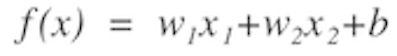
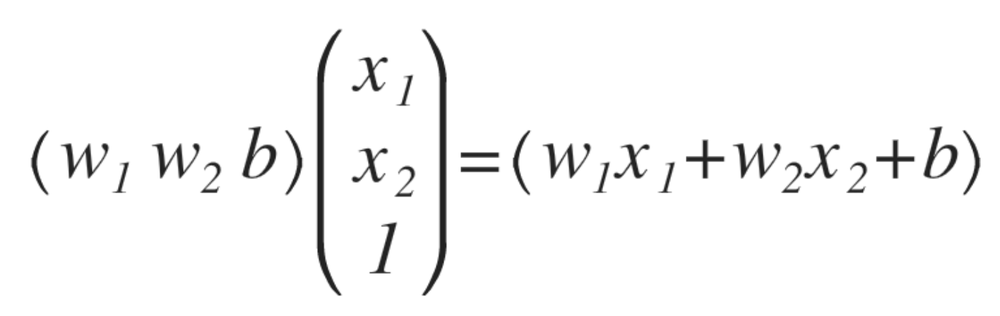
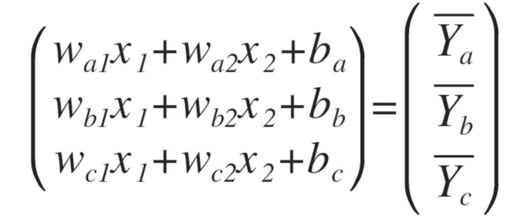
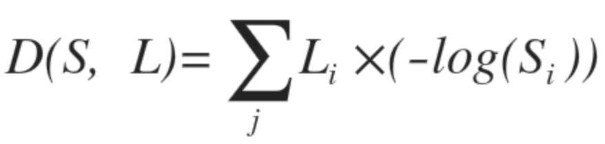

####ML 6강 Softmax Regression 기본 개념 소개
+ Softmax
 Softmax는 sigmoid를 거쳐 출력값을 0과 1사이의 출력값으로 출력해준다. 이 때, 나온 출력값들의 합은 1이 되고, 확률로 출력을 해준다고 생각해도 좋다.
 
+ Multinomial Classfication
 3개 이상의 클래스 중 하나로 분류하는 것
 ex) 중간고사, 기말고사 라는 입력값과 A, B, C 등급이 출력값으로 있다고 가정하자. binary classification을 이용해 분류를 할 수 있을까? 
  A or not / B or not / C or not 이렇게 3개의 binary classification을 이용해 표현 할 수 있으며 
  구체적으로 하나만 살펴보면 아래 그림과 같을 것이다. 
  
  
  
 
 A or not이라는 binary classification을 위 그림처럼 표현할 수 있으며, 이와 같이 3개의 binary classification을 만들면 된다.
  
 
 위에 그림이 끝이 아니다. binary classification은 0과 1로만 출력 이되기 때문에 sigmoid 함수를 한 번 거쳐줘야한다. 여기서는 Multinomial classfication을 위한 sigmoid함수는 softmax함수를 거치면 해당 클래스에 대한 확률값이 나올 것 이다.

+ One hot encoding
 가장 큰 값을 1로, 나머지를 0으로 바꿔주는 기능을 한다.
 Softmax를 거쳐 나온 확률값에 대해 One hot encoding을 진행하여 하나만 선택할 수 있게 한다.
 
+ Cost function
 여기서는 cross-entropy라는 것을 이용한다.

 
 위 그림과 같은 식을 사용하며 S는 기대출력값, L은 실제 출력값에 해당한다.
 cost function최소화는 아직까지 gradient decsent algorithm을 이용한다
